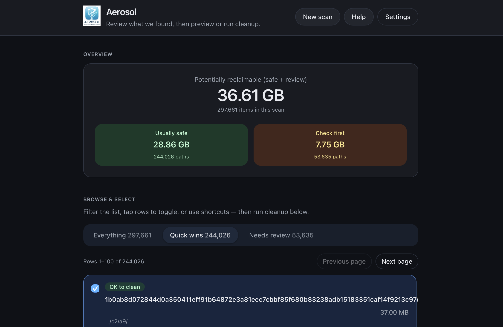
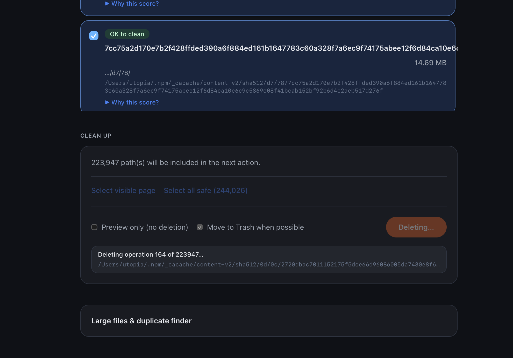
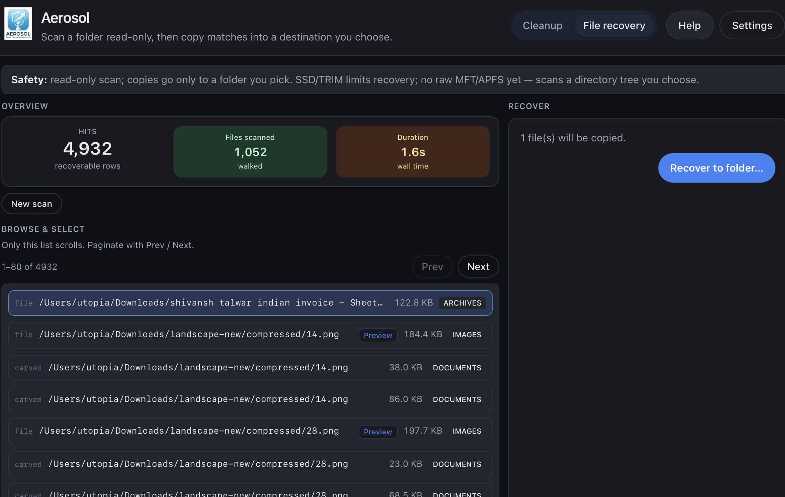

# Aerosol

**Aerosol** is a desktop disk utility for **macOS**, **Windows**, and **Linux**. It scans common clutter (caches, logs, package managers, developer artifacts), classifies findings with **risk levels**, and lets you **preview** or **clean** in batches — with optional **Trash** instead of permanent delete. A separate **File recovery** mode performs **read-only** scans of a folder you choose (including volume mount points), finds files by type signatures, supports **image and video previews**, and **copies** selections into a destination folder — without writing to the source tree. Everything runs **on your machine**; there is no cloud account or upload of your file list.

- **Source:** [github.com/januscaler/aerosol](https://github.com/januscaler/aerosol)  
- **Public docs / landing:** [aerosol.januscaler.com](https://aerosol.januscaler.com)

|        | Stack |
| ------ | ----- |
| UI     | [React](https://react.dev/) 19 + [TypeScript](https://www.typescriptlang.org/) + [Tailwind CSS](https://tailwindcss.com/) + [Vite](https://vitejs.dev/) |
| Shell  | [Tauri](https://tauri.app/) 2 |
| Engine | Rust workspace: [`aerosol_core`](crates/aerosol_core), [`aerosol_recovery`](crates/aerosol_recovery), [`aerosol_cli`](crates/aerosol_cli), [`src-tauri`](src-tauri) |
| Docs   | [VitePress](https://vitepress.dev/) site in [`website/`](website/) |

## Features

- **Filters** — Browse all findings, **safe**, or **review** buckets; paginated lists for large scans.
- **Cleanup** — Dry-run preview, **select all safe**, merged delete roots (fewer prompts), progress during deletion, optional **Move to Trash**.
- **File recovery** — Second app mode: scan a path (typed, browsed, or volume shortcuts), **Quick** (metadata + magic) or **Deep** (adds carving in the first portion of each file), filter by type (PNG, JPEG, ZIP, PDF, MP4, SQLite, JSON), paginated hits, **previews** for images and videos, **recover** by copying to another folder. Carved hits are listed but not extracted yet. Not a raw-disk / undelete tool — it walks a directory tree you select.
- **Plugins** — Built-in awareness of tools like Docker and Git; architecture supports more scanners.
- **Large files & duplicates** — Surfaces big files from the scan; optional duplicate check for large files.
- **CLI** — `aerosol` binary from the same engine (`cargo run -p aerosol_cli -- …` during development).

## Screenshots

| Overview (totals, safe vs review, filters) | Browse & select (paginated list, risk labels) | File recovery (hits, preview, recover) |
| --- | --- | --- |
|  |  |  |

Higher-resolution copies also ship with the marketing site under [`website/public/screenshots/`](website/public/screenshots/) for [aerosol.januscaler.com](https://aerosol.januscaler.com) — run `npm run sync:screenshots` from [`website/`](website/) after updating [`images/`](images/).

## Prerequisites

- [Rust](https://www.rust-lang.org/tools/install) (stable) and a C toolchain for your OS  
- [Node.js](https://nodejs.org/) (LTS recommended)  
- Platform packages for Tauri — see the [Tauri prerequisites](https://v2.tauri.app/start/prerequisites/) for your OS  

## Development

```bash
# Install JS dependencies (app UI)
npm install

# Run the desktop app (Vite + Tauri)
npm run tauri dev
```

Other useful commands:

| Command | Purpose |
| ------- | ------- |
| `npm run dev` | Vite only (web UI at dev URL; used by Tauri in dev) |
| `npm run build` | Production frontend bundle into `dist/` |
| `cargo build -p aerosol_core` | Build the core library |
| `cargo run -p aerosol_cli -- --help` | Run the CLI |
| `npm run website:dev` | VitePress dev server for [`website/`](website/) |
| `npm run website:build` | Static site output → `website/.vitepress/dist/` |

### Logo & icons

Logo extraction and Tauri icon generation (requires a local Python venv with Pillow for `logo:extract`):

```bash
python3 -m venv .venv && .venv/bin/pip install pillow
npm run logo:icons
```

## Production desktop build

```bash
npm run build
npm run tauri build
```

Installers and bundles appear under `src-tauri/target/release/bundle/` (exact layout depends on OS and Tauri bundle settings in [`src-tauri/tauri.conf.json`](src-tauri/tauri.conf.json)).

### macOS: “damaged” or can’t open (unsigned builds)

GitHub Actions builds are **not** notarized. On **Apple Silicon**, use the **aarch64** `.dmg`. If macOS says the app is **damaged**, that is usually **Gatekeeper** — see the [user manual](website/manual.md#macos-install-github-release-builds) (`xattr -cr`, **Open Anyway**, or right-click **Open**). For distribution without warnings, set up **Developer ID signing + notarization** ([Tauri docs](https://v2.tauri.app/distribute/sign/macos/)).

## Documentation & marketing site

The public site (landing, manual, comparison page, download buttons) lives in **`website/`**. It is intended to be served at **https://aerosol.januscaler.com** (Docker/Caddy in-repo, or any static host). See [`website/README.md`](website/README.md) for deployment details.

## CI releases (GitHub Actions)

1. In the repo: **Settings → Actions → General → Workflow permissions** → allow **Read and write** for the default `GITHUB_TOKEN` (releases + `gh-pages`).
2. Push a version tag:

   ```bash
   git tag v0.2.0 && git push origin v0.2.0
   ```

3. [`.github/workflows/release-tauri.yml`](.github/workflows/release-tauri.yml) will:
   - Align `package.json`, `src-tauri/tauri.conf.json`, and `src-tauri/Cargo.toml` with the tag
   - Build **macOS** (Apple Silicon + Intel), **Windows**, and **Linux** and attach artifacts to the GitHub Release
   - Rebuild the VitePress site with **direct download links**, upload **`aerosol-website.zip`**, and push **`gh-pages`** (enable **Pages** from that branch if you use GitHub Pages)

**Optional:** Docker image on tag — set repository variable **`PUSH_DOCKER_ON_RELEASE`** to `true` and secrets **`DOCKERHUB_USERNAME`** / **`DOCKERHUB_TOKEN`**.

**Website image on branch pushes** (without a release): [`.github/workflows/website-docker.yml`](.github/workflows/website-docker.yml) when `website/` changes on the default branch.

## IDE

- [VS Code](https://code.visualstudio.com/) + [Tauri](https://marketplace.visualstudio.com/items?itemName=tauri-apps.tauri-vscode) + [rust-analyzer](https://marketplace.visualstudio.com/items?itemName=rust-lang.rust-analyzer)

## Generated files & Git

`node_modules`, `website/.vitepress/dist`, `website/.vitepress/cache`, `target/`, and root `dist/` are listed in [`.gitignore`](.gitignore). If they were committed earlier, remove them from the index once (files stay on disk):

```bash
./scripts/stop-tracking-generated.sh
```

## License

Rust crates declare **MIT** in workspace metadata ([`Cargo.toml`](Cargo.toml)). Add a root `LICENSE` file if you publish the repo so terms are explicit.
